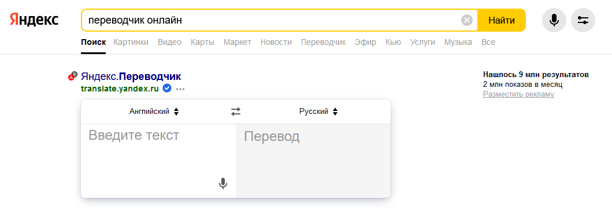

# *_План по проверке и автоматизации приложения «Яндекс переводчик»_*

## _Приложение состоит и включает в себя следующий функционал:_

>  
>

[//]: # (> 
)
>
>    - _Компоненты:_
>      - _Поле для введения переводимого текста с подсказывающим текстом «Введите текст»_
>      - _Поле для переведенного текста с подсказывающим текстом «Перевод»_
>      - _Кнопка переключатель направления ввиде двух стрелочек_
>      - _Кнопка с выпадающим списком доступных языков для ввода текста_ 
>      - _Кнопка с выпадающим списком доступных языков для переведенного текста_ 
>      - _Кнопка для вставки текста_
>      - _Кнопка озвучить текст (иконка микрофона)_
>   - _Функциолнал:_
>      - _Перевод, редактирование, вставка, удаление, озвучивание текста (символов) на различных языках._

# Чек-лист:

### Проверка приложения "_«Яндекс переводчик»_"
>    - Проверка панели управления:
>    - Проверка элементов:
>      - Кнопка **переключатель направления**
>      - Кнопка **с выпадающим списком доступных языков для ввода текста**
>      - Кнопка **c выпадающим списком доступных языков для переведенного текста**
>    - Проверка отображения текста в полях для переводимого и переведенного текста:
>    - Проверка элементов:
>     - Поле для ввода переводимого текста **"Введите текст"**
>     - Поле для ввода переведенного текста **"Перевод"**
>     - Кнопка вставки текста
>     - Кнопка очистки текста
>     - Кнопка копирования текста
>     - Кнопка озвучивания текста

## Уровни тестирования:

* _Модульное тестирование_ - проверка отдельно модулей **_Поле для ввода переводимого текста, Поле для ввода переведенного текста, выпадающие списки с доступными языками, смена направления перевода, кнопка вставки текста._**

|

* _Интеграционное тестирование_ - проверка взаимодействия между компонентами **_Поле для ввода переводимого текста, Поле для ввода переведенного текста, выпадающие списки с доступными языками, смена направления перевода, кнопка вставки текста_**

## Виды тестирования:

* Функциональное тестирование
* Тестирование пользовательского интерфейса

## Перечень автоматизируемых сценариев:

- _Тестирование функциональности ввода текста, символов, цифр в поле для перевода_
- _Тестирование функциональности перевода текста на различные языки в поле для переведенного текста_
- _Тестирование функциональности переключения направления перевода текста_
- _Тестирование функционала вставки текста в поле для перевода_
- _Тестирование функционала развертывания, свертывания выпадающих списков с доступными языками с дальнейшим выбором_
  _Перевод, редактирование, вставка, удаление, озвучивание текста (символов) на различных языках._

## Перечень используемых инструментов для автоматизации:

| **_Инструмент_**     | **_Описание_**                                                    |
|----------------------|-------------------------------------------------------------------|
| **_java_**           | язык програмирования для написания тестов                         |
| **_IntelliJ IDEA_**  | программа, для работы с кодом                                     |
| **_Selenide_**       | для работы с веб-страницей                                        |
| **_Gradle_**         | система автоматической сборки внутри android studio               |
| **_JUnit 5_**        | библиотека для тестирования                                       |
| **_Allure_**         | используем для наглядного изображения прохождения тестов и ошибок |
| **_Git_**            | система контроля версий                                           |
| **_GitHub_**         | для хранения тестов                                               |
| **_GitHub Action_**  | CI для непрерывной интеграции                                     |
| **_Microsoft Edge_** | браузер                                                           |                          

## Перечень и описание возможных рисков при автоматизации:

Возможна смена кода страницы либо css-селекторов, придется править код;  
Долгое открытие страницы сайта, либо вкладки;  
Недоступность сайта или страницы;  
Смена формы заполнения после какого-либо времени;  
Невозможность написания в форме некоторых букв ;  
Неоправданная стоимость автоматизации;  
Поиск id и прочих локаторов  

## Перечень необходимых разрешений:

Разрешение на тестирование страниц сайта с помощью автоматизированного ПО;  

## Перечень необходимых специалистов для автоматизации:

Специалист по автоматизированному тестированию;

## Интервальная оценка с учётом рисков (в часах):

Необходимое время на тестирование составляет 5 часов, с учетом рисков - 6 часов. 
